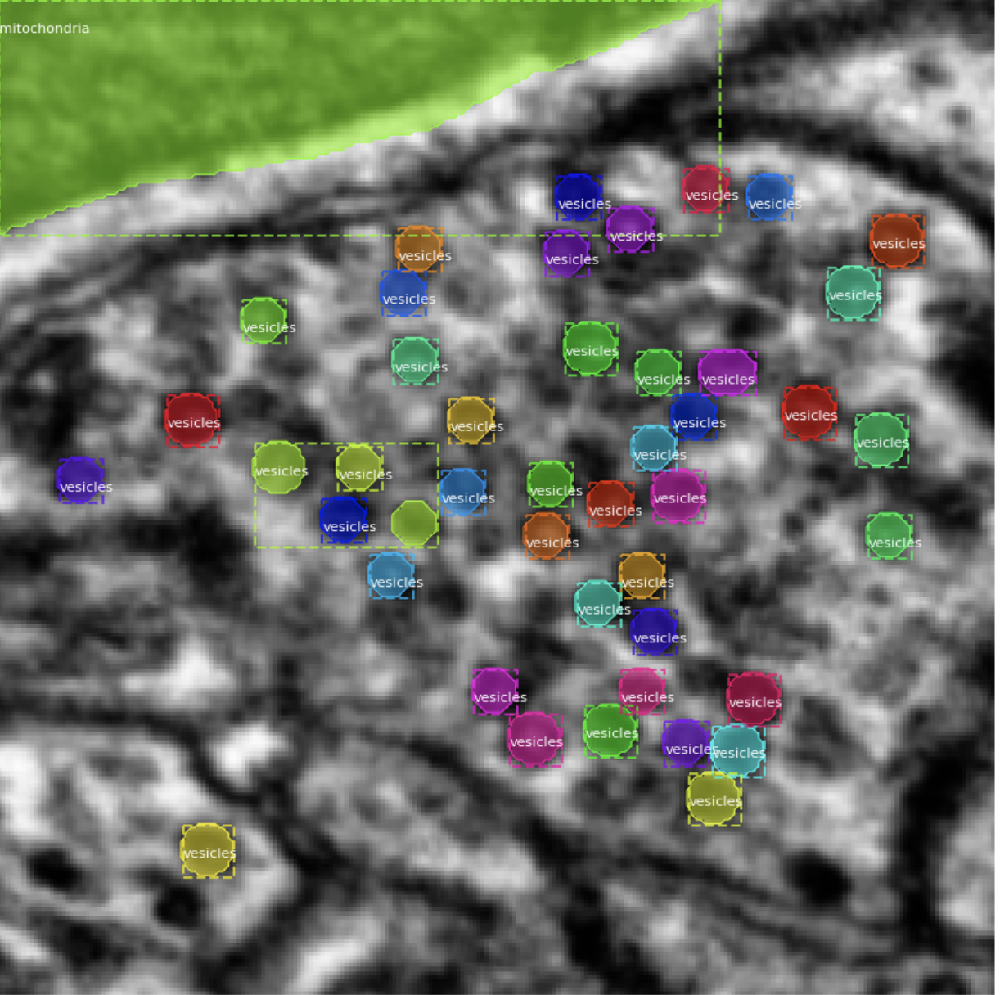

### Vesicle Segmentation

Objectives:
 - Segment vesicles in axon by implementing Mask RCNN neural net. 
 - Classify vesicles as inhibitoy, excitatory

The repository includes:

 - Source code of Mask R-CNN built on FPN and ResNet101.

 - Training code for vesicle segmentation

 - Jupyter notebooks to visualize the detection pipeline at every step


### Data

The data is from layer 2/3 of the mouse visual cortex. The dataset information can be found at the below link:

https://www.microns-explorer.org/

- Sample annotated data with vesicle's masks
- Images are 250 * 250 pixels
- There are two classes : Vesicles and Mithochondria




### Environment

1. Navigate to the `VesicleSegmentation` folder.
2. Create the conda environment with the main dependencies.
```bash
conda create --name rcnn --file requirements.txt
conda activate rcnn
pip install keras==2.1.0 opencv-python jupyterlab

```

3. Install the `MRCNN` repository.  
```bash
# should do this within the VesicleSegmentation directory on local machine
cd VesicleSegmentation
git clone https://github.com/AllenInstitute/Mask_RCNN.git
```

